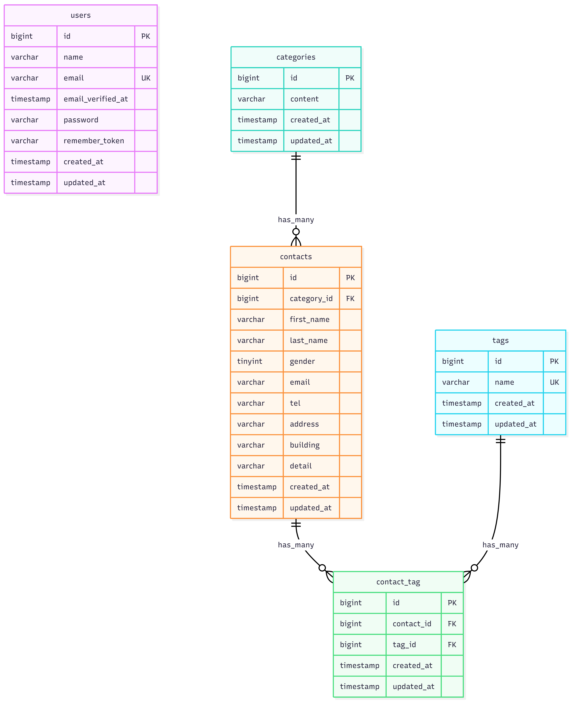

# COACHTECH お問い合わせフォーム

## 概要

お問い合わせフォームアプリケーションです。

ユーザーはお問い合わせフォームから内容を送信できます。管理者はログイン後に管理画面からお問い合わせ内容の確認・検索・削除を行えます。

また、タグ管理機能により、タグの作成・編集・削除を行うことができます。

---

## 実装機能

### お問い合わせ機能

- お問い合わせ入力
- 確認画面
- 修正機能
- お問い合わせ送信
- サンクスページ

### 認証機能

- 管理者登録
- ログイン
- ログアウト

### 管理画面

- お問い合わせ一覧
- キーワード検索
- 性別検索
- カテゴリ検索
- 日付検索
- ページネーション
- お問い合わせ詳細表示
- お問い合わせ削除

### タグ管理

- タグ作成
- タグ編集
- タグ削除

---

## ER図



---

## 使用技術

- PHP 8.2
- Laravel 10.x
- MySQL 8.0
- Nginx
- Docker
- Laravel Sail
- Laravel Fortify
- Tailwind CSS 3.4
- Alpine.js
- phpMyAdmin

---

## 環境構築

### 1. リポジトリをクローン

```bash
git clone リポジトリURL
cd contact-form-app
```

### 2. Dockerコンテナを起動

```bash
docker compose up -d --build
```

### 3. Composerパッケージをインストール

```bash
docker compose exec laravel.test composer install
```

### 4. .envファイルを作成

```bash
cp .env.example .env
```

### 5. アプリケーションキーを生成

```bash
docker compose exec laravel.test php artisan key:generate
```

### 6. データベースを作成

```bash
docker compose exec laravel.test php artisan migrate
```

### 7. 初期データを投入

```bash
docker compose exec laravel.test php artisan db:seed
```

### 8. フロントエンド環境を起動

```bash
docker compose exec laravel.test npm install
docker compose exec laravel.test npm run dev
```

---

## テスト実行

```bash
docker compose exec laravel.test php artisan test
```

---

## コード整形

```bash
docker compose exec laravel.test ./vendor/bin/pint
```

確認のみ行う場合は以下を実行します。

```bash
docker compose exec laravel.test ./vendor/bin/pint --test
```

---

## APIエンドポイント一覧

応用機能のため、現時点では未実装です。

---

## 開発環境URL

- アプリケーション: http://localhost
- phpMyAdmin: http://localhost:8080

---

## 初期ログイン情報

- メールアドレス: test@example.com
- パスワード: password

---

## 作成者

夏樹 大